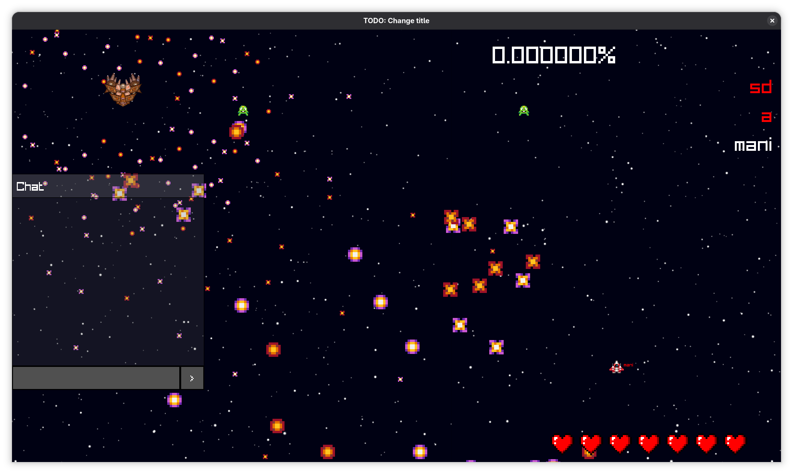

# R-Type

The R-Type is an Epitech Project, but also a known videogame !

This project is our interpretation of the game, modulated as a Bullet-Hell.

We made it using C++, the Raylib graphical library, and that's pretty much it !  

We implement a fully from-scratch & personalized network library, featuring nice packet abstraction.  
We also have a custom ECS implementation, great for showing a loooot of bullets on the screen !

Play with your friends !



## Documentation

Want to contribute ?  
Want to play ?  
Want to observe ?  

See the documentation [here](https://manigillier.github.io/rtype).

## How to get started

You need to have gcc-c++, make & cmake, and git installed. That is it !

```bash
make release
```

Three binaries will then be created :  
- `r-type_client`, graphical client.  
- `r-type_server`, server.  
- `r-type_rcon`, rcon command cli tool.  

`./r-type_client IP PORT [-d]`  
`./r-type_server -p PORT [-t TICKSPEED] [-d]`  
`./r-type_rcon IP PORT`

Example:  
`./r-rtype_client gillier.dev 4242`

If you are running a server or rcon, you can settup the RCON passkey in the `rtype.cfg` file.  
By default it will be randomly generated.

## Authors

- Mani Gillier
- Kaitomomota
- Hugo Poggetti
- Maxime Huet
