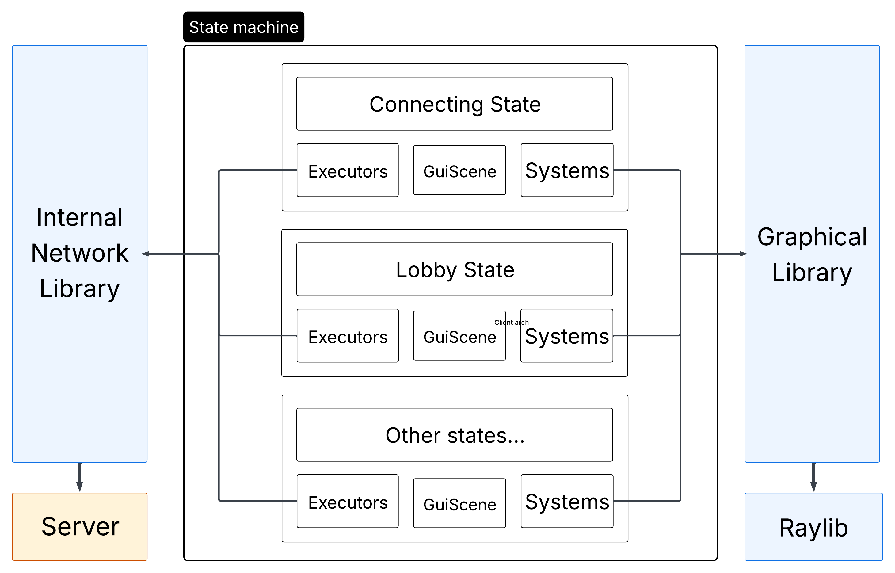

Client Documentation
====

# Summary

The client represent the playable part of the project.

A client must connect to a given running server to work.

It has a Graphical User Interface to allow a human to play the game.

# Architecture

The client is composed of two parts:  
- [The GUI & Logic](#gui--logic)  
  This is where all of the logic and rendering happen.
- [The Network](#network)  
  This is where all communications with the server happen.

The client is not responsible to determine anything except for user inputs.  
The position of the player is even determined by the server itself.

## Gui & Logic

This part of a client is defined as a state machine.

In can be in one of those states:  
- [Connection](#connection-state)
- [Lobby](#in-lobby-state)
- [Game](#in-game-state)

### Connection state

Inside the connection state, the client is preparing the connections with the server.  
It first connect with a TCP socket, and then setups a UDP connection (and this is where the loading time arise).

It is separated from the rest to forbid interaction while this crucial step is still processing.

### In lobby state

When connected, you are added to a lobby.  
This is where you wait for your friends to connect to join the game together.

Inside the lobby, you have the possibility to request the start of the game, and force every player in the lobby to switch to the game state.

### In game state

Finally, the real state. The one where you can play.

This state starts with a loading time. This is unfortunate, as we wanted to have a dedicated state for loading all ressources before connecting to the game. It will be added in the future !

Here you have the possibility to see other players, enemies, bullets and, of course, to interact and play the game with you controls.

### Composition of each state

We are using an Entity Component System to make the game work. Both rendering and logic parts are using this ECS.

Given that, every state has it's own separated entities, components and systems.  
For example, the game state has a system dedicated to showing a bullet on the screen, whilst the connecting state really don't have any bullets !

The GUI is then separated from the LOGIC, via two interfaces.

1. GUI
Inside this part, all of the rendering logic happen. We define every rendering systems, as well as rendering-related responses to network packets.
2. Logic
There we enter the logic side, like managing player inputs, deleting entities, instanciating new bullets, and so on.  
We have responses to server requests via the networking interface in this part.

Technically we do have a last state, the GAME OVER state, but it is really a very quick deconnection state, as we do not have a game over screen yet.

## Network

The client utilizes network in an extensive manner, as it needs it for almost everything !  
Indeed, almost nothing is determined by the client itself for now, and it is uncapable of even computing the position of the player.  
Thus, it needs to receive those informations from the server.

We can differentiate three kind of communication between the server and the client : 
1. **Mandatory connection communications**  
   This include the authentification of the UDP socket for example.
2. **Ponctual events**  
   For example, when a player is killed, or an enemy spawns.
3. **Continuous datastream**  
   For example, player and enemy positions, player inputs.

The architecture with executors that totally abstracts differentiation between types of packet make it fairly easy to understand how to implement a reaction to a give packet.

## Managers

- **Client Manager**  
The client itself is manager through a `ClientManager`.  
This class creates all the necessary subclasses and managers to launch the game, connect to the server and close everything without memory leaks.  
It hosts the principal game loop and the state machine, and calls the subsequent update and render methods from a given state. It is responsible for the state change, although determined by the state themselves.
- **Network Manager**  
The network manager inits the network thread. Inside this thread runs the network main loop, in change of calling the network library methods to connect to the server, poll events and send them.  
This manager also handles request of deconnections.
- **Sound Manager**  
The sound manager is a specific GUI manager that loads, plays and unloads sound files into memory.  
It serves as a cache to avoid loading the same sound file multiple times.
- **Texture Manager**  
The Texture manager does the same thing as the sound manager, but adapted for images loaded as GPU textures.

# Graphical library

For our graphical library, we chose [Raylib](https://www.raylib.com/).

It offers multiple advantages compared to other libraries:  
1. **SFML**
   - The raylib offers a higher level management of operations, with a lot of underlying global variables, offering nice and straightforward function calls.
   - The SFML, although having the nice advantage of being adapted to Object Oriented Programming, tends to be more difficult to use because of the need to keep track of all variables created. It may be preferable to have the variables in hand, but in our case with the ECS and state machine, we chose to have hidden variables.
2. **SDL**
   - The SDL is a low-level graphical library. We did not wanted to go too deep in that rabbit hole, and we stuck to the Raylib, offering higher level implementation.
3. **Direct OpenGl calls**
   - I'm not even gonna explain why we did not chose that path.

The Raylib is a really good graphical library, but we may encounter some problem with it, namely : 
- It is not really adapted to Object Oriented Programming.  
Indeed, it is not at all constructed with classes, and rely solely on direct calls to global funtions.

# Diagrams

## Client architecture diagramv

