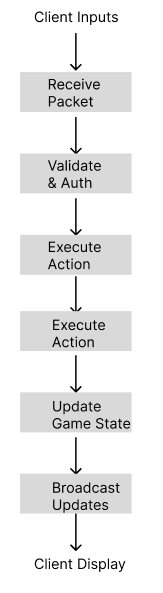
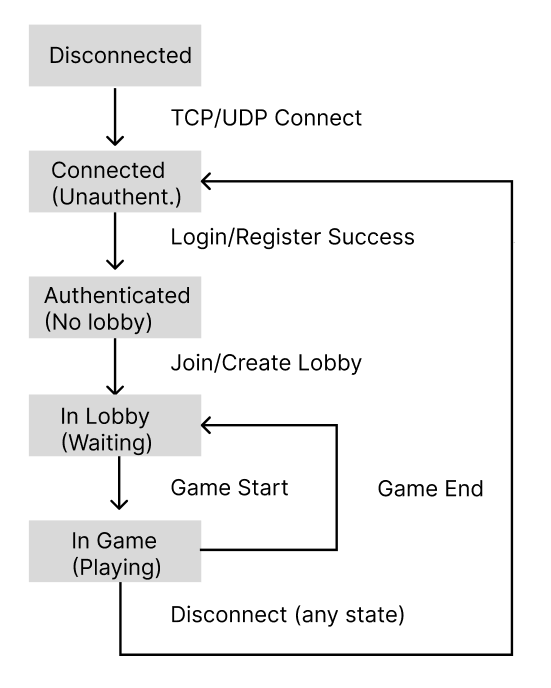
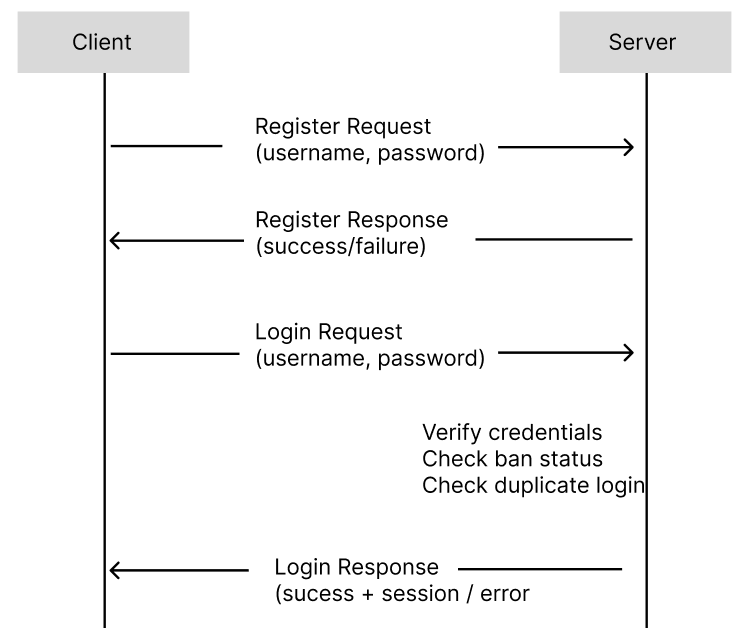
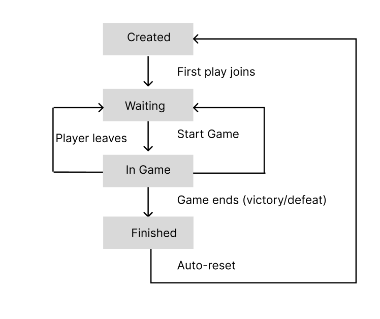
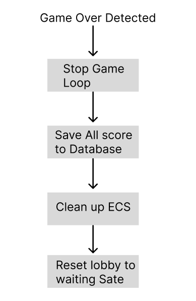
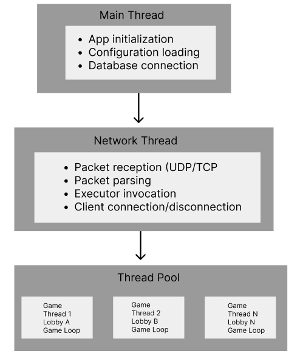

# R-Type Server Documentation

## Table of Contents

1. [Introduction](#1-introduction)
2. [Quick Start](#2-quick-start)
3. [General Architecture](#3-general-architecture)
4. [Connection Management](#4-connection-management)
5. [Lobby System](#5-lobby-system)
6. [Game Loop](#6-game-loop)
7. [Entity Component System (ECS)](#7-entity-component-system-ecs)
8. [Threading Model](#8-threading-model)
9. [Configuration](#9-configuration)
10. [Administration (RCON)](#10-administration-rcon)
11. [Login/Registration](#11-administration-rcon)
12. [Error Handling](#12-error-handling)
13. [Performance Considerations](#13-performance-considerations)

---

## 1. Introduction

### 1.1 Overview

The R-Type Server is a **dedicated authoritative game server** designed to host multiplayer
sessions of the R-Type game. It acts as the single source of truth for the game state, 
ensuring fair play and synchronized experiences across all connected clients.

The server follows a **client-server architecture** where:
- The **server** owns and manages all game logic, physics, and state
- **Clients** send inputs and receive state updates to render the game

### 1.2 Key Features

| Feature | Description |
|---------|-------------|
| **Authoritative Game State** | Server validates all actions, preventing cheating |
| **Multi-Lobby Support** | Multiple concurrent game sessions with isolation |
| **Player Authentication** | Account system with login/register functionality |
| **Persistent Progression** | Score tracking and leaderboard via database |
| **Remote Administration** | RCON system for server management |
| **Configurable Gameplay** | Wave difficulty and enemy patterns via config files |
| **Scalable Threading** | Thread pool for concurrent game instances |

### 1.3 System Requirements

- **OS**: Linux
- **Network**: UDP port availability (configurable)
- **Storage**: SQLite database for account persistence
- **Memory**: Scales with number of concurrent lobbies

### 1.4 High-Level Architecture


---

## 2. Quick Start

### 2.1 Compilation

Build the server using the project's Makefile:

```bash
# Debug build 
make server

# Release build 
make release
```

The compiled binary will be available as `r-type_server` in the project root.

### 2.2 Server Launch

The server requires a port to be specified at launch:

```bash
./r-type_server -p <port> [-t <tickrate>] [-d]
```

| Argument | Required | Description | Default |
|----------|----------|-------------|---------|
| `-p <port>` | Yes | UDP port to listen on | - |
| `-t <tickrate>` | No | Game updates per second (1-120) | 60 |
| `-d` | No | Enable debug logging | Disabled |

**Examples:**

```bash
# Start server on port 4242 with default settings
./r-type_server -p 4242

# Start with 30 tick rate and debug logging
./r-type_server -p 4242 -t 30 -d

# Production setup with 120 ticks
./r-type_server -p 8080 -t 120
```

### 2.3 Verifying Server Status

On successful startup, the server will:
1. Load or generate the RCON configuration
2. Initialize the account database
3. Begin listening for client connections
4. Display the listening port in logs

Use the RCON client to verify the server is responding (see [Administration](#11-administration-rcon)).

---

## 3. General Architecture

### 3.1 Modular Design

The server is built with a modular architecture, separating concerns into distinct layers:

```
┌─────────────────────────────────────────────────────────┐
│                    Presentation Layer                   │
│              (Packet Serialization/Parsing)             │
├─────────────────────────────────────────────────────────┤
│                    Application Layer                    │
│         (Executors, Lobby Manager, Game Logic)          │
├─────────────────────────────────────────────────────────┤
│                     Domain Layer                        │
│            (ECS, Entities, Components, Systems)         │
├─────────────────────────────────────────────────────────┤
│                  Infrastructure Layer                   │
│           (Network, Database, Configuration)            │
└─────────────────────────────────────────────────────────┘
```

### 3.2 Core Modules

| Module | Responsibility |
|--------|----------------|
| **RType** | Application entry point, initialization orchestrator |
| **RTypeServer** | Network server, client lifecycle management |
| **LobbyManager** | Lobby creation, joining, and lifecycle |
| **Game** | Game session logic, tick loop, win/lose conditions |
| **Registry (ECS)** | Entity and component storage, system execution |
| **AccountDatabase** | Persistent storage for accounts and scores |
| **ThreadPool** | Concurrent game execution management |

### 3.3 Data Flow

The server processes data through a well-defined pipeline:



**Flow Description:**

1. **Receive**: Network layer receives UDP/TCP packets from clients
2. **Validate**: Packet executor checks authentication and permissions
3. **Execute**: Action is processed (input, lobby action, etc.)
4. **Update**: Game state is modified in the ECS registry
5. **Broadcast**: State changes are sent to all relevant clients

---

## 4. Connection Management

### 4.1 Client Lifecycle

A client goes through several states during its connection to the server:



### 4.2 Authentication System

The server implements a two-phase authentication:

**Phase 1 - Whitelist Mode (Unauthenticated)**

Before authentication, clients can only send:
- Login requests
- Registration requests
- RCON commands (with valid key)

All other packets are rejected.

**Phase 2 - Full Access (Authenticated)**

After successful login, clients gain access to:
- Lobby operations (create, join, leave)
- Game actions (start, input, chat)
- Score updates

### 4.3 Authentication Flow



### 4.4 Disconnection Handling

When a client disconnects (gracefully or unexpectedly):

1. **Player Removal**: Removed from current lobby
2. **Entity Cleanup**: Player entity destroyed in ECS (if in game)
3. **Notification**: Other players notified via destroy packet
5. **Resource Cleanup**: Network resources freed

The server handles abrupt disconnections through timeout detection.

---

## 5. Lobby System

### 5.1 Concept

Lobbies are **isolated waiting rooms** where players gather before starting a game. Each lobby:
- Has a unique 6-character identifier
- Can hold 1 to 5 players
- Operates independently from other lobbies
- Owns its game instance when playing

### 5.2 Lobby Types

| Type | Visibility | Join Method | Use Case |
|------|------------|-------------|----------|
| **Public** | Listed | Auto-matchmaking | Quick play with strangers |
| **Private** | Hidden | Code sharing | Playing with friends |

**Lobby Code Format:**

```
Valid characters: 1-9, a-z, A-Z
Example: "K7MN2P"
```

### 5.3 Lobby Lifecycle



### 5.4 Player Management

**Joining a Lobby:**

```
Player Request              Server Action

Join Public       ────>     Find/create public lobby with space
Join Private      ────>     Create new private lobby, return code
Join with Code    ────>     Find lobby by code, verify space
```

**Leaving a Lobby:**

- During waiting: Player removed, others notified
- During game: Player entity destroyed, game continues
- Last player leaves: Lobby destroyed (if empty)

### 5.5 Constraints

| Constraint | Value | Reason |
|------------|-------|--------|
| Min players | 1 | Single-player allowed |
| Max players | 5 | Game balance, network bandwidth |
| Code length | 6 | Collision avoidance, easy sharing |

---

## 6. Game Loop

### 6.1 Tick Rate System

The server operates on a **fixed timestep** model:

```
Tick Rate: Number of game updates per second
Default: 60 ticks/second = 16.67ms per tick
Range: 1-120 ticks/second
```

**Why Fixed Timestep?**
- Deterministic physics simulation
- Consistent gameplay across different hardware
- Predictable network update frequency

### 6.2 Tick Execution Order

Each tick follows a precise execution order:

```
                      TICK START:

  1. Time Synchronization                                    
     - Send current server time to all clients             
                                                             
  2. Network Flush                                           
     - Send all queued packets from previous tick          
                                                             
  3. ECS Systems Update                                      
     - Position System (velocity → position)               
     - Pattern System (enemy patterns)                     
     - Collision System (hitbox detection)                 
     - Health System (damage application)                  
     - Boundary System (out-of-bounds cleanup)             
                                                             
  4. Gameplay Update                                         
     - Wave management (spawn enemies)                     
     - Win/Lose condition check                            
     - Score updates                                       
                                                             
  5. State Broadcast                                         
     - Position updates for moved entities                 
     - Destroy packets for dead entities                   
     - New entity packets for spawns                       
                                                             
  6. Wait for Next Tick                                      
     - Sleep until tick duration elapsed                   

                       TICK END                              
```

### 6.3 Wave System

Games progress through configurable **waves** of increasing difficulty:

**Wave Properties:**
- Difficulty level
- Enemy count and types
- Boss configuration (HP, patterns, size)
- Wait time between waves

### 6.4 Win/Lose Conditions

| Condition | Trigger | Result |
|-----------|---------|--------|
| **Victory** | All waves completed | Scores saved, return to lobby |
| **Defeat** | All players dead | Scores saved, return to lobby |

### 6.5 End Game Flow



---

## 7. Entity Component System (ECS)

### 7.1 Overview

The server uses an **Entity Component System** architecture for game object management. This pattern provides:

- **Performance**: Cache-friendly data layouts
- **Flexibility**: Compose behaviors through components
- **Maintainability**: Decoupled systems and data

### 7.2 Server-Managed Entities

| Entity Type | Description | Authority |
|-------------|-------------|-----------|
| **Player** | Human-controlled spaceship | Server (validates inputs) |
| **Laser** | Player projectile | Server (spawned on input) |
| **Enemy** | AI-controlled hostile | Server (full control) |
| **Boss** | Large enemy with patterns | Server (full control) |
| **Boss Bullet** | Enemy projectile | Server (pattern-based) |

### 7.3 Component Catalog

**Transform Components:**

| Component | Data | Purpose |
|-----------|------|---------|
| Position | x, y coordinates | Entity location in world |
| Velocity | dx, dy values | Movement speed and direction |
| Acceleration | ax, ay values | Velocity change over time |

**Combat Components:**

| Component | Data | Purpose |
|-----------|------|---------|
| Health | current, max HP | Damage tracking |
| HitBox | width, height | Collision boundaries |
| Damager | damage value | Damage dealt on contact |
| Resistance | reduction % | Damage mitigation |
| Hitable | flag | Can receive damage |

**Behavior Components:**

| Component | Data | Purpose |
|-----------|------|---------|
| Pattern | pattern type, params | Enemy movement/attack pattern |
| Tag | entity type enum | Entity classification |
| Dependence | parent entity ID | Lifecycle linking |
| OutsideBoundaries | flag | Cleanup when off-screen |

### 7.4 System Execution Pipeline

Systems run in a specific order each tick:

```
                 System Execution Order                 
                                                        
  1. POSITION SYSTEM                                    
     Input:  Velocity, Acceleration, Position           
     Output: Updated Position                           
                                                        
  2. PATTERN SYSTEM                                     
     Input:  Pattern, Position                          
     Output: Updated enemies positions         
                                                        
  3. LASER SYSTEM                                       
     Input:  Laser, Position                            
     Output: Updated laser entities                     
     Logic:  Move lasers, check lifetime                
                                                        
  4. COLLISION SYSTEM                                   
     Input:  Position, HitBox, Hitable                  
     Output: Collision events                           
     Logic:  AABB intersection detection                
                                                        
  5. HEALTH SYSTEM                                      
     Input:  Health, Collision events, Damager          
     Output: Updated Health, Death events               
     Logic:  Apply damage, check death                  
                                                        
  6. LOOSE SYSTEM                                       
     Input:  Player entities, Health                    
     Output: Game over flag                             
     Logic:  Check if all players dead                  
```

### 7.5 Entity Factories

Factories ensure consistent entity creation:

**Player Factory:**
```
Creates: Player entity + associated Laser entity
Components: Position, Health, HitBox, Tag, Laser reference
```

**Boss Factory:**
```
Creates: Boss entity with configured stats
Components: Position, Health (from config), HitBox (from config),
            Pattern, Damager, Velocity
```

**Bullet Factory:**
```
Creates: Projectile with pattern-based movement
Components: Position, Velocity, Damager, HitBox, OutsideBoundaries
```

---

## 8. Threading Model

### 8.1 Thread Architecture

The server uses a multi-threaded architecture to handle concurrent operations:



### 8.2 Thread Responsibilities

| Thread | Responsibility | Blocking Allowed |
|--------|----------------|------------------|
| Main | Init, shutdown, signals | No |
| Network | I/O, packet routing | Yes (I/O wait) |
| Game (pool) | Game loop, ECS update | Yes (tick sleep) |

### 8.3 Game Isolation

Each game runs in complete isolation:

**Benefits:**
- Game A crash doesn't affect Game B
- No synchronization needed between games
- Performance gain

### 8.4 Synchronization Mechanisms

Critical sections protected by mutexes:

| Mutex | Protects | Contention Level |
|-------|----------|------------------|
| `_playersMutex` | Player list in lobby | Medium |
| `_registryMutex` | ECS registry access | High (in-game) |
| `_lobbiesMutex` | Lobby collection | Low |
| `_runningMutex` | Game running state | Low |

**Best Practices Applied:**
- Minimize critical section duration
- Avoid nested locks (deadlock prevention)
- Use RAII lock guards

---

## 9. Configuration

### 9.1 Gameplay Configuration

**File:** `./server/config.cfg`

Defines wave progression and difficulty:

```
┌─────────────────────────────────────────────────────────────┐
│                      config.cfg                             │
├─────────────────────────────────────────────────────────────┤
│                                                             │
│  waves = (                                                  │
│    {                                                        │
│      difficulty = 1                                         │
│      pattern = "SPIRAL"                                     │
│      boss_hp = 100                                          │
│      boss_size = { width = 64, height = 64 }                │
│      enemy_count = 5                                        │
│      wait_time = 3.0                                        │
│    },                                                       │
│    {                                                        │
│      difficulty = 2                                         │
│      pattern = "RADIAL_BURST"                               │
│      ...                                                    │
│    },                                                       │
│    ...                                                      │
│  )                                                          │
│                                                             │
└─────────────────────────────────────────────────────────────┘
```

### 9.2 Wave Parameters

| Parameter | Type | Description |
|-----------|------|-------------|
| `difficulty` | Integer | Difficulty multiplier (1-3+) |
| `pattern` | String | Enemy attack pattern |
| `boss_hp` | Integer | Boss health points |
| `boss_size` | Object | Boss hitbox dimensions |
| `boss_damage` | Integer | Damage dealt by boss |
| `boss_speed` | Float | Boss movement speed |
| `enemy_count` | Integer | Number of enemies in wave |
| `wait_time` | Float | Seconds before wave starts |

### 9.3 Available Patterns

| Pattern | Behavior |
|---------|----------|
| `SPIRAL` | Bullets spiral outward |
| `RADIAL_BURST` | Bullets explode in all directions |
| `AIMED_SHOT` | Bullets target player position |
| `WAVE_SPREAD` | Bullets in wave formation |
| `FLOWER` | Flower-shaped bullet pattern |
| `DOUBLE_SPIRAL` | Two interleaved spirals |

---

## 10. Administration (RCON)

### 10.1 Overview

**RCON (Remote Console)** allows administrators 
to manage the server without direct access.

### 10.2 Authentication

RCON uses a **shared secret** authentication:

1. Server generates `RCON_KEY` on first startup
2. Key stored in `rtype.cfg`
3. Admin must provide key with each command
4. Invalid key = command rejected

### 10.3 Available Commands

| Command | Syntax | Description |
|---------|--------|-------------|
| `LIST` | `LIST` | Show all connected players |
| `KICK` | `KICK <username>` | Disconnect a player immediately |
| `BAN` | `BAN <username>` | Ban account (prevents future logins) |
| `UNBAN` | `UNBAN <username>` | Remove ban from account |
| `BANLIST` | `BANLIST` | List all banned accounts |

## 11. Login/Registration

## 12. Error Handling

### 12.1 Logging System

**Debug Mode** (`-d` flag) enables verbose logging:

```
[TIMESTAMP] [MODULE] Message
─────────────────────────────────────
[12:34:56] [NETWORK]    Client connected: 192.168.1.10
```

### 12.2 Graceful Degradation

| Scenario | Server Response |
|----------|-----------------|
| Client timeout | Remove from lobby, notify others |
| Database unavailable | Reject new registrations, allow cached logins |
| Game thread crash | Terminate lobby, preserve other games |
| Invalid packet | Ignore, log warning |

---

## 13. Performance Considerations

### 13.1 Scalability

**Horizontal Scaling (Lobbies):**

**Factors limiting concurrent lobbies:**
- Available CPU threads
- Memory per game instance
- Network bandwidth

### 13.2 Network Optimization

**Packet Batching:**

Instead of sending immediately, packets are queued and flushed once per tick:

Benefits:
- Reduced packet overhead
- Better bandwidth utilization
- Predictable network load

---

## See Also

- [Network Protocol (RFC)](../../RFC.md) - Detailed packet specifications
- [Client Documentation](../client/README.md) - Client-side architecture
- [ECS Development Guide](../ecs.md) - Working with the ECS framework
